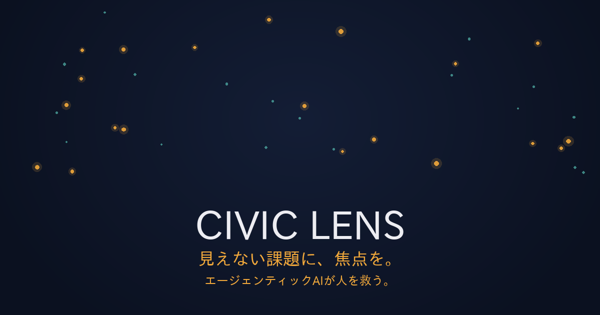

# Civic Lens — 市民の怒りを情報公開に変換するAIエージェント

[](https://github.com/t-sakaki/civic-lens/actions/workflows/ci.yml)
[](https://civic-lens-jp.vercel.app)
[](https://zenn.dev/hackathons/google-cloud-japan-ai-hackathon-vol5)



> 🏆 **2026年9月5日、「Zenn Agentic AI ミニハッカソン with Google Cloud」（東京・渋谷 Google拠点、参加者約200名）にて優勝しました。** コーディング時間約2時間という短時間実装での受賞です。詳細は[🏆 受賞歴](#-受賞歴)をご覧ください。

## 🎯 概要

**Civic Lens**は、市民が行政に対して抱く「怒り・不信・諦め」を、**情報公開請求・審査請求**という法的アクションに自動変換するAIエージェントです。

市民は弁護士なしで、年間30万件以上の情報公開請求制度をフル活用できます。

## 🏛️ 解決する課題

### 市民のペイン
- **「何を請求していいかわからない」** — 行政手続に不慣れな90%の市民が挫折
- **「不開示だったらどうするか」がわからない** — 審査請求フローがブラックボックス化
- **「弁護士費用10万円」は払えない** — 法テラス（民事法律扶助）は償還原則
- **「役所は敵だ」という諦め** — 制度はあるが機能していない歪み

### 行政の不誠実
- **「不存在」を盾にした逃げ** — 形式的応答で実質隠蔽
- **抽象的・紋切り型の不開示理由** — 「法人情報」「事務執行影響」等の一般条項滥用
- **裁決の遅延** — 答申まで6ヶ月〜2年、事件の風化

## ✨ 機能

Civic Lens は、市民の「怒り・不信・諦め」を入力すると、AIが法的回答を返す：

| 市民の入力 | AI の出力 |
|---|---|
| 「許せない！腹が立つ！」 | 怒りレベル測定・条例マッチング |
| 「何百万円も使って成果が分からない」 | 開示請求書の自動生成 |
| 「不開示決定を受けた」 | 審査請求書 + 反論ロジック |
| 「役所に行きたい」 | 駅すぱあとAPIで経路案内 |

### 詳細機能

1. **感情解析（YouCam API）** — 市民の怒り表情を検知し、エージェントへの入力に変換
2. **条例自動マッチング（Vertex AI + GMI Cloud）** — 市民の怒り内容から適用条例を自動特定
3. **開示請求書・司法行政文書開示申出書の自動生成** — 17機関（7自治体・議会 + 4警察本部 + 6裁判所）対応。行政文書だけでなく裁判所の「司法行政文書の開示に関する事務の取扱要綱」に基づく開示請求にも完全対応
4. **審査請求書 + 反論ロジック生成** — 不開示決定への反論を判例・先例（自治体条例、警察情報公開規程、裁判所取扱要綱）を交えて構築。先例として提示する認容事例は、総務省「行政不服審査裁決・答申検索データベース」から収集した実在のデータをGemini Embeddingsによるベクトル検索で照合したものを使用し、Geminiによる先例の「創作」を防止
5. **期限管理（60日ルール等）** — Cloud Scheduler で自動通知
6. **窓口までの経路案内（駅すぱあとAPI）** — 市民が実際に行動する後押し
7. **シチュエーション別テンプレート** — 13種類（海外視察、公共事業、補助金、警察事案、裁判所司法行政・予算執行等）から選ぶだけ

## 🛠️ 技術スタック

**Google Cloud ADK (Agent Development Kit)** を中核に構築：

| スポンサー | 役割 | 実装 |
|---|---|---|
| **Google Cloud ADK + Vertex AI Agent Engine** | エージェント本体 | `agent.py`（LlmAgent + SequentialAgent）|
| **GMI Cloud (DeepSeek V4 Pro)** | 条例・判例RAG推論 | `gmi_client.py` |
| **駅すぱあとAPI** | 最寄り市役所までの経路案内 | `station_guide.py` |
| **YouCam API** | 市民の怒り表情解析 | `emotion_analyzer.py` |
| **総務省 行政不服審査裁決・答申検索データベース + Gemini Embeddings** | 認容事例の実データ検索（先例の「創作」防止） | `precedent_cases.py`, `scripts/scrape_gyofuku_cases.py`, `scripts/build_precedent_embeddings.py` |

### ADKアーキテクチャ
```
SequentialAgent (civic_lens_integrated)
   ├── LlmAgent (anger_analyzer) [Gemini 2.5 Pro]
   │     ├── FunctionTool: analyze_user_anger
   │     ├── FunctionTool: get_ordinance_info
   │     └── FunctionTool: get_situation_documents
   └── LlmAgent (counter_argument_builder) [Gemini 2.5 Pro]
         └── FunctionTool: get_counter_argument
```

### 補助技術
- **FastAPI** — Python Web フレームワーク
- **Tailwind CSS** — UI
- **Cloud Run** — デプロイ
- **Cloud Scheduler** — 期限通知cron
- **Firebase Authentication + Firestore** — ユーザー認証（メール/パスワード・Web3ウォレット）、開示請求記録・フォーク・スターの永続化。Cloud Runのステートレスなコンテナ間でもデータを保持するために使用

### 🤖 認容事例 自動収集エージェント（定期実行）

反論ロジックに使う先例データは、`.github/workflows/scrape-precedents.yml` により週1回（サーバー負荷に配慮し高頻度にはしない）自動更新される。GitHub ActionsがPlaywrightで総務省「行政不服審査裁決・答申検索データベース」(https://fufukudb.search.soumu.go.jp/koukai/Main) を巡回して認容・一部認容事例を収集（`scripts/scrape_gyofuku_cases.py`）し、続けてGemini Embeddings（`gemini-embedding-001`）で検索用ベクトルを計算する（`scripts/build_precedent_embeddings.py`、既に計算済みのcase_idは再計算しないキャッシュ設計）。`workflow_dispatch`により手動実行も可能。

収集データはPDL1.0（公共データ利用規約）に配慮し、裁決・答申の全文ではなくデータベースが提示する概要スニペットのみを保存し、各レコードに出典URLを必ず添付する。また、mainブランチへの直接コミット・pushは行わず、差分が生じた場合のみ`peter-evans/create-pull-request`でブランチを切ってプルリクエストを作成し、人間のレビュー・マージを介す設計にしている。

## 📁 ファイル構成

```
civic-lens/
├── app.py                            # FastAPI メイン（エンドポイント定義）
├── agent.py                          # Gemini エージェント本体
├── ordinance_data.py                 # 5自治体分の条例データ
├── station_guide.py                  # 駅すぱあとAPI統合
├── emotion_analyzer.py               # YouCam API統合
├── gmi_client.py                     # GMI Cloud RAG
├── precedent_cases.py                # 認容事例の検索（Gemini Embeddings + Ngramフォールバック）
├── scripts/
│   ├── scrape_gyofuku_cases.py       # 総務省DBからの認容事例スクレイパー
│   └── build_precedent_embeddings.py # 認容事例の埋め込みベクトル生成
├── templates/
│   ├── index.html                    # メインユーザーインターフェース
│   └── precedent_cases.html          # 認容事例 閲覧・検索ページ
├── .github/workflows/
│   └── scrape-precedents.yml         # 認容事例 自動収集エージェント（定期実行）
├── requirements.txt
├── Dockerfile
└── README.md
```

## 🚀 ローカル開発

```bash
# 1. 依存インストール
pip install -r requirements.txt

# 2. 環境変数設定
export GOOGLE_CLOUD_PROJECT="your-project-id"
export GOOGLE_CLOUD_LOCATION="asia-northeast1"
export GEMINI_API_KEY="your-gemini-api-key"
export GMI_API_KEY="your-gmi-api-key"
export EKISPERT_API_KEY="your-ekispert-key"
export YOUCAM_API_KEY="your-youcam-key"
export FIREBASE_WEB_API_KEY="your-firebase-web-api-key"

# 3. Firestoreへのアクセス権を設定（ローカル開発時のみ）
gcloud auth application-default login

# 4. 起動
uvicorn app:app --host 0.0.0.0 --port 8080
```

→ http://localhost:8080 でアクセス

## ☁️ Cloud Run デプロ

```bash
# Dockerビルド
docker build -t gcr.io/$PROJECT_ID/civic-lens .

# Container Registryにプッシュ
docker push gcr.io/$PROJECT_ID/civic-lens

# Cloud Run デプロ
gcloud run deploy civic-lens \
    --image gcr.io/$PROJECT_ID/civic-lens \
    --platform managed \
    --region asia-northeast1 \
    --allow-unauthenticated \
    --set-env-vars="GOOGLE_CLOUD_PROJECT=$PROJECT_ID,GMI_API_KEY=$GMI_API_KEY,EKISPERT_API_KEY=$EKISPERT_API_KEY,YOUCAM_API_KEY=$YOUCAM_API_KEY"
```

## ⚖️ 法的留意点

本エージェントは**弁護士法72条（非弁行為）に抵触しないよう**、以下の点に留意しています：

1. **AIは「法的助言」ではなく「情報提供・書式作成支援」**に限定
2. **最終判断は必ず市民（ユーザー）が行う**（Human-in-the-loop）
3. **法律行為の代理は行わない**
4. **免責事項を明示**

参考: Legal AI株式会社の本人訴訟支援サービス（無料提供）は同じアプローチで弁護士法72条をクリアしている。

## 📊 評価軸（ハッカソン）

| 軸 | Civic Lens の強み |
|---|---|
| **Technological Implementation** | 4社APIの統合実装（Gemini + GMI + 駅すぱあと + YouCam） |
| **Design** | 怒りメーター + 視覚的UI |
| **Potential Impact** | 年間30万件以上の情報公開請求の90%挫折問題を解決 |
| **Quality of the Idea** | 弁護士法72条を遵守した本人支援型エージェント |

## 🎬 デモシナリオ

1. **市民の怒り入力**: 「市長の海外視察費用が知りたい。何百万円も使って成果が分からないのは許せない」
2. **表情入力**: YouCam APIで市民の怒りを検知
3. **分析結果**: 怒りレベル8/10、安城市情報公開条例第7条4号が該当と表示
4. **開示請求書生成**: AIが請求書を自動生成
5. **経路案内**: 駅すぱあとAPIで安城市役所までのアクセスを表示
6. **審査請求対応**: 不開示決定時の反論ロジック生成

## 🏆 受賞歴

### Zenn Agentic AI ミニハッカソン with Google Cloud（優勝）

- **開催日**: 2026年9月5日
- **会場**: 東京・渋谷 Google拠点
- **規模**: 参加者約200名、2部屋に分かれての開催（[第5回 Agentic AI Hackathon with Google Cloud](https://zenn.dev/hackathons/google-cloud-japan-ai-hackathon-vol5) のスピンオフ企画）
- **結果**: 単独参加で**優勝**
- **実装時間**: コーディング時間は約2時間のみという、ハッカソンとしては異例の短時間実装

**評価されたポイント**

- 4社API（Gemini + GMI Cloud + 駅すぱあと + YouCam）を統合し、市民の「怒り・不信・諦め」を情報公開請求という具体的な法的アクションへ自動変換する一気通貫の実装
- Google AntiGravityなどAIエージェントを活用した超短時間でのフルスタック実装
- 「情報公開請求のGitHub」というコンセプトのもと、開示請求のPublic/Private共有・フォーク・スター機能を実装し、共有された請求を集合知として地域の行政問題の可視化につなげるアイデア

## 📜 ライセンス

MIT License

## 👥 作者

Zenn Agentic AI ミニハッカソン with Google Cloud — 2026/9/5 参加・**優勝**

## 🙏 謝辞

- Google Cloud Japan
- GMI Cloud
- ヴァル研究所（駅すぱあとAPI）
- YouCam API
- 安城市の実際の運用知見（実案件ベース）