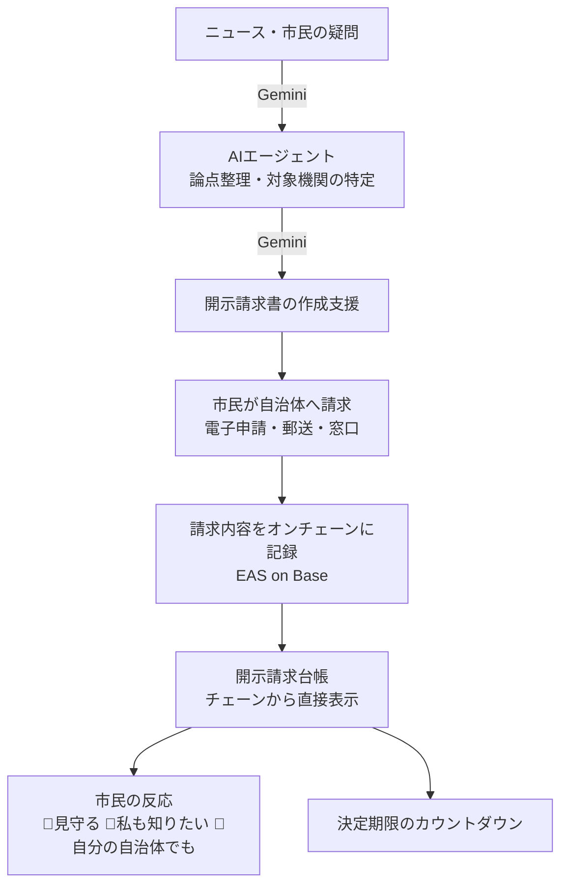

# はじめに

「第5回 Agentic AI Hackathon with Google Cloud」に向けて、**Civic Lens** を開発しています。
市民が行政に抱いた疑問を、AIエージェントが公文書開示請求という具体的な行動に変えるアプリです。

今回は開発途中経過として、**実在の開示請求1件を、ブロックチェーン上の公開台帳に記録するところまで**できたので、その仕組みと、途中でつまずいた点を共有します。

# 課題：開示請求は「本人と役所の間」で閉じている

公文書開示請求は、市民が行政を監視するための数少ない法的手段です。しかし現状では、

- 請求の内容も、行政の対応も、**請求した本人と役所の間だけ**で完結している
- 条例で決まった決定期限を過ぎても、**本人以外は誰も気づかない**
- 同じ文書を別の人が請求していても、その結果が共有されない

日本には国レベルの公的オンブズマン制度がなく、この役割は主に市民団体の地道な活動が担ってきました。Civic Lens は、その活動を強くする道具を目指しています。

# Civic Lens の全体像



- **AIエージェント層（Google Cloud / Gemini）**：ニュースや市民の声から論点を整理し、請求先の実施機関（例：「愛知県」ではなく「愛知県知事」）と請求すべき文書を特定して、請求書の作成を支援します。
- **台帳層（今回の進捗）**：実際に行った請求を、改ざんできない公開記録として残します。

# 今回の進捗：実在の開示請求をオンチェーンに記録

愛知県知事に対して行った、次の開示請求を記録しました（請求文は私自身が作成したものです）。

> 愛知県が運営する婚活支援ポータルサイト「あいこんナビ」における個人情報誤掲載（漏洩）事件に関する以下の行政文書。1.委託契約書および仕様書 2.受託業者からの業務報告書 3.個人情報管理に関する県の点検・監査記録 4.情報漏洩事案に関する調査報告書および発覚後の対応・責任所在に関する会議録（対象期間：事業開始から請求日現在まで）

記録はこちらで誰でも確認できます（Base Sepolia テストネット）。
https://base-sepolia.easscan.org/attestation/view/0x9141b625cb51f4490d6d4f34f9ec2d69b5af2a9128edc58aab56dfc719845c6e

<!-- ここに easscan のスクリーンショットを貼る -->

## 何を平文で載せ、何を隠すか

記録には [Ethereum Attestation Service（EAS）](https://attest.org/) を使い、次のスキーマを定義しました。

```
string recordId, string authority, string requestedDocuments,
bytes32 documentHash, uint256 timestamp, string legalBasis
```

| 項目 | 扱い |
|---|---|
| 請求先・根拠条例 | 平文で公開 |
| 請求した公文書の特定内容 | **公開の請求のときだけ**平文で公開 |
| 氏名・住所・申請番号を含む請求書全文 | **SHA-256 ハッシュのみ**（外からは読めない） |

ブロックチェーンの記録は消せません。そのため、平文で載せる前に、人名＋敬称・電話番号・郵便番号・番地・メールアドレスなどを検出して警告し、本人が確認しない限り送信しない仕組みにしています。

## どうやって「誰でも検証」するのか

1. **誰でも**：easscan で「いつ・どこに・何を請求したか」と、記録者（Civic Lens の公証アドレス）を確認できます。記録は私自身にも書き換えられません。
2. **原本を持っている人**：請求書全文のハッシュを計算し、オンチェーンの値と比べれば、「この日時にこの内容で存在した」ことを照合できます。1文字でも違えば一致しません。

なお、ブロックチェーンの時刻は技術的な存在証明であって、法律上の「確定日付」とは異なります。

## 開示請求台帳ページ

Civic Lens に `/ledger` ページを追加しました。ポイントは、**表示内容を自前のデータベースではなく、EAS の公開 GraphQL からチェーンを直接読んで作っている**ことです。これにより、Civic Lens 自身も表示内容をごまかせません。

<!-- ここに /ledger のスクリーンショットを貼る -->

- **決定期限のカウントダウン**：愛知県情報公開条例第12条は「開示請求があった日から起算して15日以内（延長は30日以内）」と定めています。記録日から目安を計算して表示します。
- **事実と意見を分けて表示**：上段がオンチェーンの事実、下段が市民の反応（オフチェーン）です。
- **リアクションは3種類だけ**：👀見守る／🙋私も知りたい／🔁自分の自治体でも。「怒り」のリアクションは置いていません。実在の請求と実在の行政が相手なので、攻撃の場にしないためです。件数だけを公開し、誰が押したかは保存時にもハッシュ化しています。

「何人の市民が見守っているか」が見えること自体が、行政に期限を守ってもらうための穏やかな後押しになると考えています。

# ハマりどころ（技術メモ）

実装中に踏んだ落とし穴を残しておきます。EAS を Python から使う方の参考になれば幸いです。

## 1. EAS の attestation UID は topics ではなく data に入っている

```solidity
event Attested(address indexed recipient, address indexed attester, bytes32 uid, bytes32 indexed schemaUID);
```

`uid` は `indexed` ではないので、ログの `data` の先頭32バイトに入ります。`topics[3]` は **schemaUID** です。最初は `topics[3]` を読んでいたため、すべての記録のUIDがスキーマUIDと同じになっていました。

```python
ATTESTED_EVENT_TOPIC = Web3.keccak(text="Attested(address,address,bytes32,bytes32)")
for log in receipt.logs:
    if log.topics and log.topics[0] == ATTESTED_EVENT_TOPIC:
        attestation_uid = Web3.to_hex(log.data[:32])
```

## 2. hexbytes 1.0 以降の `.hex()` は `0x` を付けない

web3.py 7 系以降（hexbytes 1.0 以降）では、`HexBytes.hex()` が `0x` なしの文字列を返します。UID やトランザクションハッシュを保存・表示する箇所は `Web3.to_hex()` に統一しました。

## 3. 連続送信で nonce が衝突する

公開 RPC ではノードの反映が遅れることがあり、`get_transaction_count(address)` が直前の送信を数えずに同じ nonce を返しました。`get_transaction_count(address, "pending")` で解決しています。

## 4. 条例の期限はデータを鵜呑みにしない

機関データでは愛知県の決定期限が「30日」になっていましたが、条例の原文を確認すると第12条は「15日以内」でした。行政を監視するツールが期限を間違えては本末転倒なので、一次資料で確認して修正しました。

# 次にやること

- **処分の記録**：県から決定（開示・一部開示・不開示）が届いたら、EAS の `refUID` で今回の請求にひもづけて記録し、請求 → 処分 → 審査請求 → 答申 → 裁決を1本の線でつなぎます。
- **裁決の自動確認**：総務省「行政不服審査裁決・答申検索データベース」をもとに、Gemini で裁決の結論を判定するエージェントを実装中です。
- **AIエージェントとの接続**：Civic Lens で作成した請求を、そのまま台帳に記録できる流れを整えます。

# おわりに

「AIが請求を手伝う」だけでなく、「その後に行政がどう応えたか」までを誰でも検証できる形で残すことで、市民が行政を継続的に見守れる仕組みを作りたいと考えています。

引き続き開発を進めます。フィードバックをいただけるとうれしいです。
